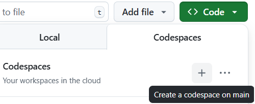

<p align="center">
  
</p>

# Rust for data science - 2025/09/23

This repository is designed to help you learn Rust from the ground up, with a focus on its ecosystem tools such as Cargo, the package manager and build system, and PyO3, the library that bridges Rust and Python. Rust is increasingly being adopted in areas that demand high performance and reliability, making it a valuable complement to Python in Data Science workflows. With PyO3, you can seamlessly integrate Rust functions into your Python projects, combining Python’s flexibility with Rust’s speed and safety.

## Table of Contents

1. [**Learning objectives**](#learning-objectives)
2. [**Workshop structure**](#workshop-structure)
3. [**References and materials**](#references-and-materials)
4. [**Setup**](#setup)
5. [**Exercices**](#exercices)
6. [**Correction**](#correction)

## Learning objectives 

After completing this workshop, you will be able to:

1. Discover the basics of the Rust programming language and Cargo, its package manager.

2. Understand how to set up and configure a Python ↔ Rust environment (maturin, PyO3, uv).

3. Write Rust code and expose it as Python modules using PyO3

4. Use profiling tools to measure where Python code spends the most time

5. Compare Python and Rust implementations of common data science algorithms

6. Apply Rust to accelerate data science and machine learning workflows


## Workshop structure

This workshop provides a guided introduction to Rust, Cargo, and PyO3. It concludes with two hands-on exercises designed to put your knowledge into practice and deepen your understanding through real applications:

- **First exercice**: optimizing a Python function that matches 2D points to polygons. Starting from a baseline implementation, the goal is to progressively move parts of the computation to Rust to significantly speed up the process.

- **Second exercice** Comparing the performance of different machine learning algorithm implementations. You will measure and visualize execution times for:
  - Python scratch (manual implementation)
  - Python scikit-learn
  - Rust scratch (exposed to Python via PyO3)


In this workshop, there are 3 levels of difficulty: easy, intermediate and hard. To check the **Exercise** correction, you must go to the `Correction` branch with :
```bash
git checkout Corection
```

## References and materials 

Here is the documentation used for the completion of the workshop:

- [**Basics of Rust**](./docs/rust.md)
- [**Basics of Cargo**](./docs/cargo.md)
- [**How to use PyO3**](./docs/pyo3.md)
- Complete guide for Rust: [The Book](https://doc.rust-lang.org/book/)

- [Rust tutorial (W3Schools)](https://www.w3schools.com/rust/rust_intro.php)

- [The Cargo Book (Rust official page)](https://doc.rust-lang.org/cargo/index.html)
- [PyO3 user guide (PyO3 official page)](https://pyo3.rs/main/function.html)
- Guide for [py-spy](https://github.com/benfred/py-spy)


  ## Setup

  Choose your preferred environment to complete this workshop:

## Option 1 — Local Setup (VSCode/Cursor)

If you're comfortable working locally, simply clone the repository and follow the common instructions above.

### Clone project
```bash
git clone git@github.com:jinchengluo/rust_for_data_science.git
```

### Install Rust and Cargo
```bash
curl --proto '=https' --tlsv1.2 https://sh.rustup.rs -sSf | sh
```

Check with `rustc --version` and `cargo --version`

### Install uv
```bash
curl -LsSf https://astral.sh/uv/install.sh | sh
```

### Create `.venv`
```bash
uv venv # at the root of the repo
source .venv/bin/activate
```

### Install dependencies
```bash
uv sync
```

## Option 2 — Cloud Setup (GitHub Codespaces)

For a zero-installation experience directly in your browser:

1. Go to the repository on GitHub
2. Select your desired branch (`main`, `TODO_easy`, etc.)
3. Click the green "Code" button → "Create codespace"
4. Once the Codespace loads, run:
   ```bash
   uv sync
   source .venv/bin/activate
   ```
   You're now ready to start coding!

> **Important**: Each Codespace is tied to the branch you selected when creating it. To switch branches, go back to GitHub, select the new branch, and click on the + icon in the top right corner to create a new Codespace for that branch then repeat step 4.

<p align="center">
  
</p>

## Exercices

Here are the links to the `.ipynb` notebook files for the three difficulty levels:
- [Easy](/poly_match_rs/py_project/Exercice/exercice_EASY.ipynb)
- [Intermediate](/poly_match_rs/py_project/Exercice/exercice_INTERMEDIATE.ipynb)
- [Hard](/poly_match_rs/py_project/Exercice/exercice_HARD.ipynb)


## Correction

Here is the link for the [Correction](Correction.ipynb) notebook. The correction for the Rust part is [here](/poly_match_rs/src/CORRECTION/)